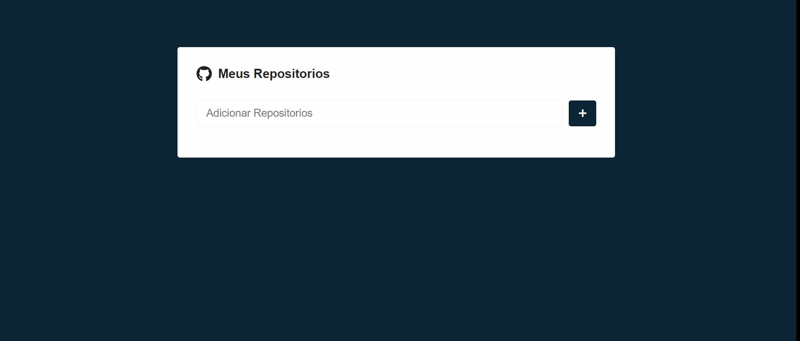

# Busca de repositório github

Para este projeto o usuário pode criar uma lista dos seus repositórios favoritos onde:

* Ele pode salvar quantos repositórios quiser;
* Pode deletá-los a qualquer momento;
* Ao clicar na barra no ícone das 3 barras ele é direcionado para uma página com os detalhes daquele repositório;
* Nessa página são informadas também as issues do repositório selecionado;
* As issues podem ser exibidas pelos de acordo com seu estado atual e para facilitar na busca ele pode escolher pelos botões se deseja exibir todas as issues, somente as com state abertas ou ainda as com state fechadas;
* O sistema ainda não permite que o usuário coloque mais de uma vez o mesmo repositório na lista;
* Se ele clicar no botão adicionar sem ter informado um nome de repositório válido a barra do input ficará vermelha e no momento digitar ela volta para sua cor normal;
* Enquanto a página com o repositório carrega um ícone de loading aparece para o usuário;

# Aprendizado/usado no projeto:

* axios;
* useState/useEffect;
* react-router-dom;
* react-spinner-material;
* loading;
* consumo API;
* syled-components;

## Veja o projeto completo:

https://busca-repo-react.netlify.app/

## Feito Com:

### Contato

  
   

Copyright © 2022 Keitey Lopes Barros

